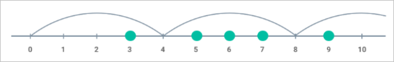

# Minimun Jump Exercise (Python)

## Technical Question

You are given a series of integer numbers tat represent the coordinates of obstacles located on a straight linea.

Supose you are jumping from the location with coordinate 0 to the right. Only jumps of the same distance (represented by an integer number) are allowed.

Find the minimum jump distance to clear all the obstacles.

##### For example, given the obstacle coordinates:

- coordinates = [5, 3, 6, 7, 9]

The minimum jump must be :

- minimumJump(coordinates) = 4

#### Suggested inputs and expected outputs:

In the repository template, al utilizar "python3 main.py [parameters]" must receive the input paramenters with the following format:

- "list of comma separated numbers (obstacles)"
- Example: "5,3,6,7,9"
- The parameter is stored in 'arrayObstacles' variable.

The expected result is the minimum jump distance and it should be assigned to the 'minimumJump' variable. The variable will be shown on the screen as shown below:

- The minimum jump to avoid all obstacles is: [minimumJump]
- Example: The minimum jump to avoid all obstacles is: 4

Also, the final message printed with 'print' must be kept.

**TO CONSIDER:** SWe know of the existence of answer for this question on the internet, but we would like to know you analytic skills to solve this problem. We hope you have good alogoritmic skills to work properly within our team.
